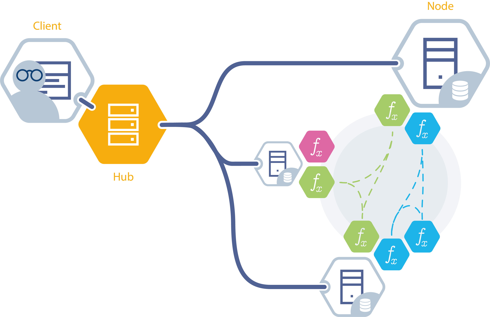

<h1 align="center">
  <br>
  <a href="https://vantage6.ai"></a>
</h1>

<h3 align=center> A Privacy Enhancing Technology (PET) Operations platform</h3>
<h3 align="center">

<!-- Badges go here-->

[](https://github.com/vantage6/vantage6/actions/workflows/release.yml)
[](https://badge.fury.io/py/vantage6)
[](https://github.com/vantage6/vantage6/actions/workflows/unit_tests.yml)
[](https://coveralls.io/github/vantage6/vantage6?branch=main)
[](https://app.codacy.com/gh/vantage6/vantage6/dashboard?utm_source=gh&utm_medium=referral&utm_content=&utm_campaign=Badge_grade)
[](https://zenodo.org/badge/latestdoi/492818831)
[](https://discord.gg/yAyFf6Y)
[](https://research-software-directory.org/software/vantage6)


</h3>

<p align="center">
  <a href="#books-quickstart">Quickstart</a> •
  <a href="#project-structure">Project structure</a> •
  <a href="#gift_heart-join-the-community">Join the community</a> •
  <a href="#scroll-license">License</a> •
  <a href="#black_nib-code-of-conduct">Code of conduct</a> •
  <a href="#black_nib-references">References</a>
</p>

---

This repository is contains all the **vantage6** infrastructure source code. The **vantage6** technology enables to manage and deploy privacy enhancing technologies like Federated Learning (FL) and Multi-Party Computation (MPC). Please visit our [website](https://vantage6.ai) to learn more!

You can find more (user) documentation at [readthedocs](https://docs.vantage6.ai). If you have any questions, suggestions or just want to chat about federated learning: join our [Discord)](https://discord.gg/yAyFf6Y) channel.

## Infrastructure overview



_A High level overview of the vantage6 infrastructure. Vantage6 has both a
client-server and peer-to-peer architecture. The client is used by the researcher to
create (PET) computation requests. It is also used to manage users, organizations and
collaborations. The server contains users, organizations, collaborations, tasks and
their results. It provides a central access point for both the clients and nodes. The
nodes have access to privacy sensitive data and handle computation requests retrieved
from the server. Computation request are executed as separate containers on the node.
These containers are connected to containers at other nodes by a VPN network._

## :books: Quickstart

### Requirements

The **vantage6** infrastructure is delivered in Docker images. To run these images, you
need to have [Docker](https://docs.docker.com/get-docker/) installed. To install the
latest version of the vantage6 CLI, you need to have
[Python](https://www.python.org/downloads/), we recommend using an environment manager
like [mini-conda](https://docs.conda.io/en/latest/miniconda.html).

Install the latest version of the vantage6 CLI by using:

```bash
pip install vantage6
```

This install the `v6` commands, which allows you to manage your nodes and servers. To view all available options, run:

```bash
v6 --help
```

For example you can create a local test setup by using:

```bash
v6 dev create-demo-network
```

This creates a local network with a server and two nodes. You can start the network by running:

```bash
v6 dev start-demo-network
```

This will start the server and nodes in the background. You can view the logs by running:

```bash
# View node logs
v6 node attach

# View server logs
v6 server attach
```

From here you can use the [vantage6-client](https://pypi.org/project/vantage6-client)
to interact with the server. The demo network has a pre-configured organization with
the following credentials:

- Username: `dev_admin`
- Password: `password`

For example, you can create a new organization by running:

```python
from vantage6.client import Client

client = Client('http://127.0.0.1', 7601, '/api', log_level='debug')
client.authenticate('dev_admin', 'password')
client.setup_encryption(None)

client.organization.create(
    name='My organization',
    address1='My address',
    address2='My address',
    zipcode='1234AB',
    country='The Netherlands',
    domain='my-organization.com'
)
```

You can find more (user) documentation at [readthedocs](https://docs.vantage6.ai)

## Project structure

### PYPI packages

This repository is home to 6 PyPi packages:

- [vantage6](https://pypi.org/project/vantage6) -> _CLI for managing node and server instances_
- [vantage6-client](https://pypi.org/project/vantage6-client) -> _Python client for interacting with the vantage6-server_
- [vantage6-algorithm-tools](https://pypi.org/project/vantage6-algorithm-tools) -> _Python tools to facilitate algorithm development_
- [vantage6-node](https://pypi.org/project/vantage6-node) -> _Node application package_
- [vantage6-server](https://pypi.org/project/vantage6-server) -> _Server application package_
- [vantage6-algorithm-store](https://pypi.org/project/vantage6-algorithm-store) -> _Algorithm store application package_
- [vantage6-common](https://pypi.org/project/vantage6-common) -> _Package with common vantage6 functions_
- [vantage6-backend-common](https://pypi.org/project/vantage6-backend-common) -> _Package with functions common to central server and algorithm store_

**Note that when using vantage6 you do not install the _server_ and _node_ packages. These are delivered to you in Docker images.**

This repository also hosts the code for the vantage6 user interface (UI). The UI
is an Angular web application that can be used to interact with the vantage6 server
easily.

### Docker images

The vantage6 infrastructure is delivered in Docker images. All Docker images are stored
in our private [Harbor](https://goharbor.io/) registry. The most important images are:

- `harbor2.vantage6.ai/infrastructure/node:VERSION` -> _Node application Docker image_
- `harbor2.vantage6.ai/infrastructure/server:VERSION` -> _Server application Docker image_
- `harbor2.vantage6.ai/infrastructure/ui:VERSION` -> _User interface Docker image_
- `harbor2.vantage6.ai/infrastructure/algorithm-store:VERSION` -> _Algorithm store Docker image_

with `VERSION` being the full semantic version of the vantage6 infrastructure, e.g.
`4.0.0` or `4.1.0rc0`.

Several other images are used to support the infrastructure:

- `harbor2.vantage6.ai/infrastructure/infrastructure-base:VERSION` -> _Base image for the infrastructure_
- `harbor2.vantage6.ai/infrastructure/squid:VERSION` -> _Squid proxy image used for the whitelisting service_
- `harbor2.vantage6.ai/infrastructure/alpine` -> _Alpine image used for vpn traffic forwarding_
- `harbor2.vantage6.ai/infrastructure/vpn-client` -> _VPN image used to connect to the VPN_
- `harbor2.vantage6.ai/infrastructure/vpn-configurator` -> _VPN image used for initialization_
- `harbor2.vantage6.ai/infrastructure/ssh-tunnel` -> _SSH tunnel image used for connecting algorithms to external services_

And finally there are some images released for algorithm development:

- `harbor2.vantage6.ai/infrastructure/algorithm-base:MAJOR.MINOR` -> _Base image for algorithm development_
- `harbor2.vantage6.ai/infrastructure/algorithm-ohdsi-base:MAJOR.MINOR` -> _Extended algorithm base image for OHDSI algorithm development_

## :gift_heart: Join the community!

We hope to continue developing, improving, and supporting **vantage6** with the help of 
the federated learning community. If you are interested in contributing, first of all, 
thank you! Second, please take a look at our 
[contributing guidelines](https://docs.vantage6.ai/en/main/devops/contribute.html) 
and our [code of conduct](CODE_OF_CONDUCT.md).

<a href="https://github.com/vantage6/vantage6/graphs/contributors">
  
</a>

## :scroll: License

This project is licensed under the Apache License 2.0 - see the [LICENSE](LICENSE) file for details.

## :black_nib: Code of Conduct

Please note that this project is released with a [Contributor Code of Conduct](CODE_OF_CONDUCT.md). **By participating in any way in this project you agree to abide by its terms.**

## :black_nib: References

If you are using **vantage6**, please cite this repository as well as the accompanying papers as follows:

> - F. Martin, M. Sieswerda, H. Alradhi, et al. vantage6. Available at https://doi.org/10.5281/zenodo.7221216. Accessed on MONTH, 20XX.
> - A. Moncada-Torres, F. Martin, M. Sieswerda, J. van Soest, G. Gelijnse. VANTAGE6: an open source priVAcy preserviNg federaTed leArninG infrastructurE for Secure Insight eXchange. AMIA Annual Symposium Proceedings, 2020, p. 870-877. [[BibTeX](https://arturomoncadatorres.com/bibtex/moncada-torres2020vantage6.txt), [PDF](https://vantage6.ai/vantage6/)]
> - D. Smits\*, B. van Beusekom\*, F. Martin, L. Veen, G. Geleijnse, A. Moncada-Torres, An Improved Infrastructure for Privacy-Preserving Analysis of Patient Data, Proceedings of the International Conference of Informatics, Management, and Technology in Healthcare (ICIMTH), vol. 25, 2022, p. 144-147. [[BibTeX](https://arturomoncadatorres.com/bibtex/smits2022improved.txt), [PDF](https://ebooks.iospress.nl/volumearticle/60190)]

---

<p align="center">
  <a href="https://vantage6.ai">vantage6.ai</a> •
  <a href="https://discord.gg/yAyFf6Y">Discord</a> •
  <a href="https://vantage6.discourse.group/">Discourse</a> •
  <a href="https://docs.vantage6.ai">User documentation</a>
</p>
